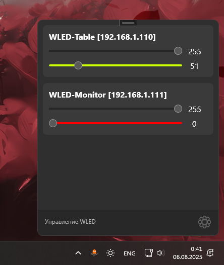

# WLED Tray Controller - [Русский](https://github.com/Ve5os/Wled-Tray/blob/master/README.md) 

**WLED Tray** is a convenient minimalist app for Windows 11\10 that lets you control WLED devices right from the system tray. The program is written in WPF with a focus on classic Windows 11 style and maximum ease of use.

---

## 🔧 Features

- 📡 Automatic discovery of WLED devices on the local network (WIP)  
- 🧱 Control cards for each device:  
  - Brightness (0–255)  
  - Saturation (0–255) (WIP)  
  - Color (Hue, 0–255)  
- 🎨 Color visualization of the Hue slider  
- 🔁 Live data updates on slider change  
- 🧼 Clean, adaptive, and custom UI  

---

## 🖥️ Screenshots

| Tray and control cards | Showcase |
|-----------------------|----------|
|  |  |

---

## 📦 Installation

1. Download the latest [release](https://github.com/ve5os/WLED-Tray/releases)  
2. Run `Wled Tray.exe`  
3. The app will appear in the system tray (bottom right)  
4. Control WLED without the browser ✨  
5. Add the app to startup  

---

## ⚙️ How to use

- **Add device manually:**  
  - Go to settings  
  - Open the WLED section  
  - Enter IP address (e.g., `192.168.1.123`)  
  - Click `ADD`  

- **Adjust parameters:**  
  - Drag sliders to change brightness, saturation, and color  
  - Changes apply automatically on slider release  

- **Remove device:**  
  - Go to settings  
  - Open the WLED section  
  - Click the `✖` button on the card  

---

## 💡 TODO / Ideas

- [ ] Save cards between sessions  
- [ ] Support groups and zones  
- [ ] Animations when removing cards  
- [ ] Auto-discovery with progress indicator  
- [ ] Support different WLED effects  

---

## 👨‍💻 Author

**Vepa / Ve5os**  
🛠 Enthusiast of gadgets, DIY, Home Assistant, and more.  

---

## 📄 License

MIT — do whatever you want with the project, just don't forget to link back to the original ✌️
