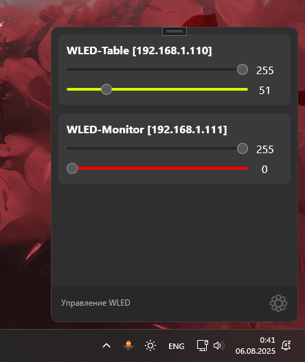

# WLED Tray Controller  - [English](https://github.com/Ve5os/Wled-Tray/blob/master/README.md) 

**WLED Tray** — это удобное минималистичное приложение для Windows 11\10, позволяющее управлять WLED-устройствами прямо из системного трея. Программа написана на WPF с упором на классический Windows 11 Style и максимальную простоту управления.

---

## 🔧 Возможности

- 📡 Автоматическое обнаружение WLED-устройств в локальной сети (WIP)
- 🧱 Карточки управления для каждого устройства:
  - Яркость (0–255)
  - Насыщенность (Saturation, 0–255) (WIP)
  - Цвет (Hue, 0–255)
- 🎨 Цветовая визуализация ползунка Hue
- 🔁 Живое обновление данных при изменении слайдера
- 🧼 Чистый, адаптивный и кастомный UI

---

## 🖥️ Скриншоты

| Трей и карточки управления | Демо |
|---------------------------|-----------|
|  |  |

---

## 📦 Установка

1. Скачайте последний [релиз](https://github.com/ve5os/WLED-Tray/releases)
2. Запустите `Wled Tray.exe`
3. Приложение появится в системном трее (справа внизу)
4. Управляйте WLED без браузера ✨
5. Добавьте приложение а автозапуск

---

## ⚙️ Как использовать

- **Добавить устройство вручную:**
  - Перейдите в настройки
  - Откройте раздел WLED
  - Введите IP в поле (например, `192.168.1.123`)
  - Нажмите `Добавить`

- **Изменение параметров:**
  - Перетаскивайте ползунки для изменения яркости, насыщенности и цвета
  - Изменения применяются автоматически при отпускании ползунка

- **Удаление устройства:**
  - Перейдите в настройки
  - Откройте раздел WLED
  - Нажмите на крестик `✖` на карточке

## 💡 TODO / Идеи

- [ ] Сохранение карточек между запусками
- [ ] Поддержка групп и зон
- [ ] Анимации при удалении карточек
- [ ] Автопоиск с прогресс-индикатором
- [ ] Поддержка разных эффектов WLED

---

## 👨‍💻 Автор

**Вепа / Ve5os**  
🛠 Увлекаюсь гаджетами, DIY, Home Assistant и так далее.

---

## 📄 Лицензия

MIT — делай с проектом что хочешь, но не забудь дать ссылку на оригинал ✌️
